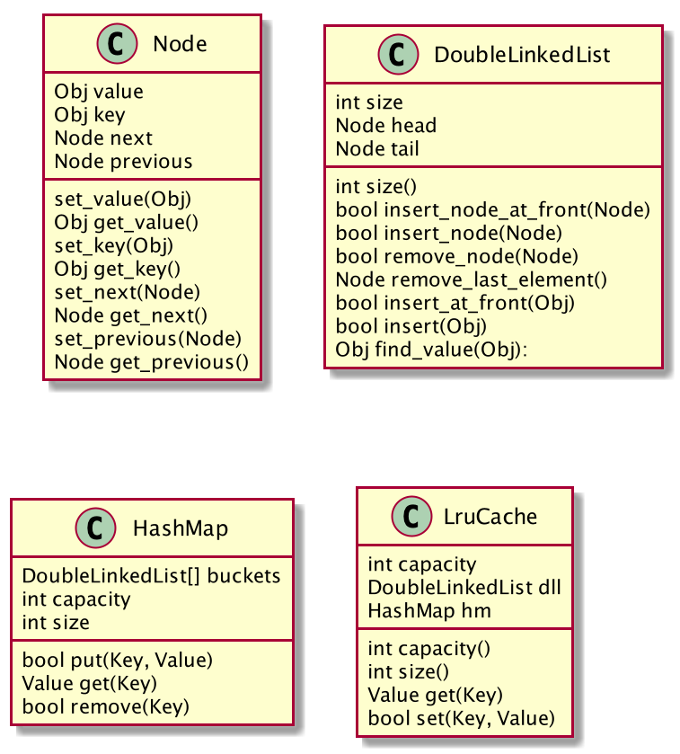

### PROBLEM #1

### Design
The LRU cache was designed using the following classes:

* Node class wraps two values inside of the class "value" and "key".
* DoubleLinkedList stores instances of "Node", this class also defines a "head" and "tail" to allow insertions at the 
beginning or at the end of the list. 
* HashMap allows constant access to store and retrieve elements store on it using a "key". Every "key" is associated 
with its correspondent value. The values are internally stored on an array of DoubleLinkedList to store keys that 
result to the same hash.

### LRU Class
This class defines a hash map to provides constant access time to store and retrieve elements stored on the cache. It 
also make use of a DoubleLinkedList to keep the order of the most used items on the cache. As a result, the items that
are a the bottom of the list will be removed if the capacity is reached and an additional element will be added at the 
top of the list.

#### Set elements on a Cache
To set an element on a cache there are three different cases:

* Add a new element
* Replace the value of an existing element
* Add a element when capacity has been reached

##### Add a new element
Below is the flow to add a new element that does not exist on the cache and when the capacity of the cache has not 
been reached.

![set_cache]

[set_cache]: cache_set_new.png

##### Replace the value of an existing element
If a key does exist on the HashMap it will retrieve the existing node and its value will be replaced. Finally, this node
will be removed from the DoubleLinkedList and added to the top of it. Below is the flow described:

![replace_cache]

[replace_cache]: cache_replace_value.png

##### Add a element when capacity has been reached
If a new element needs to be added but the capacity of the HashMap has been reached. Then the last element from the 
DoubleLinkedList needs to be deleted from the HashMap to make space for the new element that needs to be added. Below is
the flow described:

![max_capacity_cache]

[max_capacity_cache]: cache_set_max_capacity.png

#### Get elements on a Cache
Every time an element is retrieved from a cache. The element is being removed from its current location on the 
DoubleLinkedList and added at the top of the list.

![cache_get]

[cache_get]: cache_get.png

### Space Complexity
The space complexity for the cache data structure is O(2N) because we need to kee two different data structures:

* HashMap
* DoubleLinkedList

The overall big o complexity is O(N) for the cache.

### Running Time Complexity
The running time complexity for add and retrieve elements from a cache is O(1). The trade off is tha this data structure 
requires more space. 
