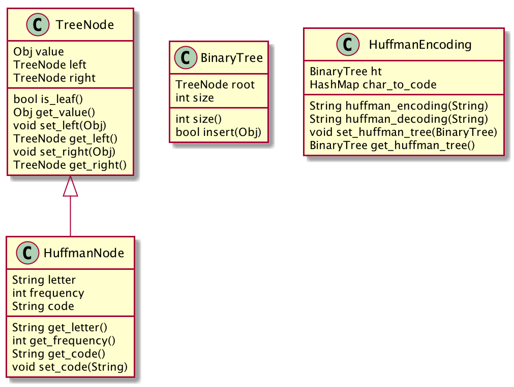

### PROBLEM #3

### Design
The Huffman algorithm works by assigning codes that correspond to the relative frequency of each character for each 
character. The Huffman code can be of any length and does not require a prefix; therefore, this binary code can be 
visualized on a binary tree with each encoded character being stored on leafs. The Huffman encoder was designed using 
the following classes:

### Huffman encoder
There are many types of pseudocode for this algorithm. At the basic core, it is comprised of building a Huffman tree, 
encoding the data, and, lastly, decoding the data.

Here is the overall pseudocode that was used:

* Take a string and determine the relevant frequencies of the characters.
* Build a HashMap of each letter as the key and its frequency as the value.
* Sort the entries on the HashMap from lowest to highest frequencies using a 
PriorityQueue.
* Build the Huffman Tree (Binary tree) from the elements stored on the PriorityQueue 
* Assigning a binary code to each leaf in the Binary Tree using shorter codes for the more frequent letters (This is the
heart of the Huffman algorithm).
* Build a HashMap and store the letter as the key and the binary code as the value.
* Encode the text into its compressed form using the previous built HashMap.

### Space Complexity
The space of this problem is O(n) for the binary tree to encode/decoded text.

### Running Time Complexity
The running time complexity huffman encoder/decoder is as follows:

* Encode:
  * To encode a given element a PriorityQueue needs to be built to keep the elements sorted on this data structure it 
  takes O(N log N). Building a binary tree will take O(N) and traversing the elements ont he binary tree will take 
  O(log N). Finally, encoding the element is being done using a HashMap that takes O(N) to encode all the letters to a 
  binary code. As result the overall running time to encode will be  O(N log N).
* Decode: 
  * For every encoded symbol you have to traverse the tree in order to decode that symbol. The tree contains N nodes on 
average, it takes O(log N) node visits to decode a symbol. As a result, the time complexity of the Huffman algorithm to 
decode is O(N log N).